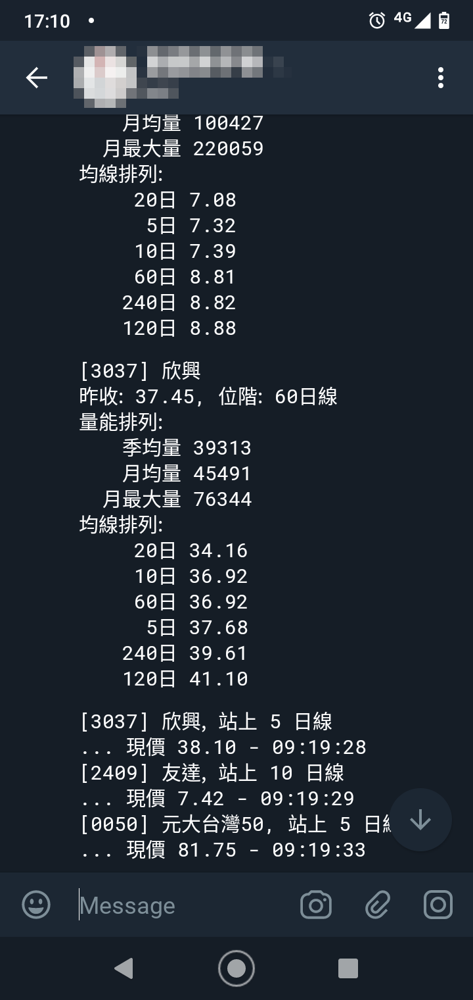

## 群益證券聽牌套件 (skcom)

此套件用來降低群益證券 API (SKCOM.dll) 的使用門檻，目前可蒐集歷史與即時報價資訊，也提供輔助工具引導安裝 API 元件，
透過輔助安裝工具會安裝 VC++ 可轉發套件中較為安全的版本，比依照官方文件安裝更理想

此套件僅相容 Windows 64 位元, 無法確保在其它環境正常運作, 驗證環境如下:

* Windows 10 64位元, Anaconda 2019.03 Python 3.7 version
* Windows 10 64位元, Python 3.5

**注意事項**

* **此套件並非群益證券開發, 使用問題請透過 GitHub Issue 回報**
* **在群益證券開戶, 並且開通 API 使用權限後才能使用**

## 功能

0.9.4

* 新增 Telegram 機器人範例, 盤中監控價量
* 提供參數自動回答登入時的公告
* 日 K 快取處理
* skcom.tools.clean 能移除 VC++ 2010 可轉發套件
* API 版本跟進到 2.13.21, 確保逐筆交易正常運作
* 改善 skcom.helper 的穩定性
* 設定檔改用 YAML 格式

0.9.3 修正首次安裝相依套件失敗問題

* 改用 logging.yaml 配置 logger
* log 檔目錄不存在時, 自動產生目錄

0.9.2 加強對新版元件的相容性

* 解決 2.13.17+ 元件無法登入的問題
* 解決 2.13.18 自動安裝失敗問題
* 環境清除工具

0.9.1 首次發布

* 蒐集日 K 資料
* 接收即時撮合結果
* 必要環境輔助安裝工具 (Visual C++ 可轉發套件與 SKCOM.dll)

## 環境安裝

安裝相依套件, 安裝前會提示要求管理者權限

```powershell
> pip install skcom
> python -m skcom.tools.setup
INFO    | 安裝 Visual C++ 2010 可轉發套件
INFO    | Visual C++ 2010 可轉發套件已安裝, 版本: 10.0.40219.325
INFO    | 安裝與註冊群益 API 元件
INFO    | 群益 API 元件已安裝, 版本: 2.13.21.0
INFO    | 生成 site-packages\comtypes\gen\SKCOMLib.py
INFO    | 群益 API 元件模組已生成
```

如果要升級群益 API 元件，建議先使用環境清除工具再重新安裝，避免 comtypes 自動生成碼與元件版本不相容

```powershell
> python -m skcom.tools.clean
INFO    | 移除 comtypes 套件自動生成檔案
INFO    |   路徑 C:\Users\Unknown\AppData\Local\Programs\Python\Python38\lib\site-packages\comtypes\gen
INFO    |   移除 Scripting.py
INFO    |   移除 SKCOMLib.py
INFO    |   移除 stdole.py
INFO    |   移除 _00020430_0000_0000_C000_000000000046_0_2_0.py
INFO    |   移除 _420B2830_E718_11CF_893D_00A0C9054228_0_1_0.py
INFO    |   移除 _75AAD71C_8F4F_4F1F_9AEE_3D41A8C9BA5E_0_1_0.py
INFO    |   移除 __pycache__
INFO    | 移除群益 API 元件
INFO    |   路徑: C:\Users\Unknown\.skcom\lib
INFO    |   解除註冊: C:\Users\Unknown\.skcom\lib\SKCOM.dll
INFO    |   移除元件目錄
INFO    | 移除 Visual C++ 2010 x64 Redistributable

> python -m skcom.tools.setup
```


## 使用 Ticks 監聽範例

```powershell
> python -m skcom.samples.ticks
登入成功
連線成功
連線就緒
[2330 台積電] 時間:09:00:00.530 買:0.00 賣:0.00 成:233.50 單量:3594 總量:3594
[2330 台積電] 時間:09:00:05.543 買:233.00 賣:233.50 成:233.50 單量:87 總量:3681
[2330 台積電] 時間:09:00:10.558 買:233.00 賣:233.50 成:233.50 單量:3 總量:3684
[2330 台積電] 時間:09:00:15.573 買:233.00 賣:233.50 成:233.00 單量:31 總量:3715
[2330 台積電] 時間:09:00:20.588 買:233.00 賣:233.50 成:233.50 單量:20 總量:3735
[2330 台積電] 時間:09:00:25.603 買:233.00 賣:233.50 成:233.00 單量:15 總量:3750
[2330 台積電] 時間:09:00:30.618 買:233.00 賣:233.50 成:233.00 單量:22 總量:3772
[2330 台積電] 時間:09:00:35.633 買:233.00 賣:233.50 成:233.50 單量:6 總量:3778
[2330 台積電] 時間:09:00:40.649 買:233.00 賣:233.50 成:233.00 單量:8 總量:3786
[2330 台積電] 時間:09:00:45.661 買:233.00 賣:233.50 成:233.00 單量:52 總量:3838
...
偵測到 Ctrl+C, 結束監聽
斷線
監聽結束
```

## 使用日 K 監聽範例

```powershell
> python -m skcom.samples.kline
[23:48:49] INFO    | 系統公告: SKReplyLib_OnReplyMessage:Announcement callback.
[23:48:52] INFO    | 登入成功
[23:48:55] INFO    | 連線成功
[23:48:59] INFO    | 連線就緒
[23:48:59] INFO    | 載入 0050 的日 K 快取
[23:48:59] INFO    | 載入 2409 的日 K 快取
[23:48:59] INFO    | 載入 3037 的日 K 快取
[23:48:59] INFO    | 股票名稱載入完成
[23:48:59] INFO    | 日 K 請求完成
[0050 元大台灣50] 的日K資料
>> 日期:2020-04-17 開:83.00 收:83.25 高:84.00 低:82.70 量:34467
>> 日期:2020-04-16 開:80.20 收:80.80 高:81.10 低:80.05 量:12365
>> 日期:2020-04-15 開:81.25 收:81.20 高:81.50 低:81.00 量:17315
>> 日期:2020-04-14 開:79.05 收:80.95 高:80.95 低:79.05 量:13057
>> 日期:2020-04-13 開:79.00 收:78.80 高:79.40 低:78.55 量:7375
[2409 友達] 的日K資料
>> 日期:2020-04-17 開:7.52 收:7.37 高:7.64 低:7.35 量:88910
>> 日期:2020-04-16 開:7.50 收:7.42 高:7.51 低:7.41 量:51383
>> 日期:2020-04-15 開:7.56 收:7.56 高:7.62 低:7.50 量:59279
>> 日期:2020-04-14 開:7.45 收:7.49 高:7.52 低:7.42 量:64789
>> 日期:2020-04-13 開:7.49 收:7.35 高:7.65 低:7.33 量:76080
[3037 欣興] 的日K資料
>> 日期:2020-04-17 開:39.30 收:38.10 高:39.60 低:37.70 量:46194
>> 日期:2020-04-16 開:36.80 收:38.10 高:38.70 低:36.75 量:41179
>> 日期:2020-04-15 開:38.80 收:37.40 高:39.90 低:37.40 量:57824
>> 日期:2020-04-14 開:36.45 收:38.15 高:38.85 低:36.05 量:58945
>> 日期:2020-04-13 開:35.80 收:35.55 高:36.80 低:35.35 量:60773
[23:49:38] INFO    | 偵測到 Ctrl+C, 結束監聽
[23:49:39] INFO    | 結束連線
[23:49:39] INFO    | 監聽結束
```

## 使用 Telegram 機器人範例

```
> python -m skcom.samples.bot
[23:55:47] INFO    | 系統公告: SKReplyLib_OnReplyMessage:Announcement callback.
[23:55:49] INFO    | 登入成功
[23:55:51] INFO    | 連線成功
[23:55:55] INFO    | 連線就緒
[23:55:55] INFO    | 載入 2409 的日 K 快取
[23:55:55] INFO    | 股票名稱載入完成
[23:55:55] INFO    | 日 K 請求完成
[23:55:55] INFO    | [2409] 友達
[23:55:55] INFO    | 昨收: 7.37, 位階: 20日線
[23:55:55] INFO    | 量能排列:
[23:55:55] INFO    |   　季均量 98959
[23:55:56] INFO    |   　月均量 108309
[23:55:56] INFO    |   月最大量 220059
[23:55:56] INFO    | 均線排列:
[23:55:56] INFO    |   　 20日 6.94
[23:55:56] INFO    |   　 10日 7.38
[23:55:56] INFO    |   　  5日 7.44
[23:55:56] INFO    |   　240日 8.86
[23:55:56] INFO    |   　120日 8.91
[23:55:56] INFO    |   　 60日 8.96
[23:55:56] INFO    | $
[23:55:56] INFO    | [2409] 友達, 站上 5 日線
[23:55:56] INFO    | ... 現價 7.52 - 09:00:03
[23:55:56] INFO    | [2409] 友達, 跌破 5 日線
[23:55:56] INFO    | ... 現價 7.43 - 11:28:18
[23:55:56] INFO    | [2409] 友達, 跌破 10 日線
[23:55:56] INFO    | ... 現價 7.38 - 11:38:48
[23:55:56] INFO    | [2409] 友達, 站上 10 日線
[23:55:56] INFO    | ... 現價 7.39 - 11:38:51
[23:55:56] INFO    | [2409] 友達, 跌破 10 日線
[23:55:56] INFO    | ... 現價 7.38 - 11:39:09
[23:55:56] INFO    | [2409] 友達, 在 10 線震盪
[23:55:56] INFO    | ... 15 分鐘 - 11:54:17
[23:55:56] INFO    | [2409] 友達, 在 10 線震盪
[23:55:56] INFO    | ... 31 分鐘 - 12:10:07
[23:55:56] INFO    | [2409] 友達, 在 10 線震盪
[23:55:56] INFO    | ... 60 分鐘 - 12:38:59
[23:55:59] INFO    | 偵測到 Ctrl+C, 結束監聽
[23:55:59] INFO    | 結束連線
[23:56:00] INFO    | 監聽結束
```



## 交易日重要時機

* 09:00 開盤, T < 09:00:00.000 會產生大量試撮 Ticks, 不可計入成交量
* 13:25 準備收盤, 13:25:00.000 <= T < 13:30:00.000 會產生大量試撮 Ticks, 不可計入成交量
* 13:30 收盤, 13:30:00.000 會有最後一筆撮合, 要計入成交量
* 14:30 零股撮合
* 14:37 零股撮合 Ticks 事件觸發, 這時候才能收到零股交易資料
* 14:40 系統疑似統計中, 查詢個股資訊沒有回應
* 14:45 日 K 資料出現當日交易, 系統恢復正常
